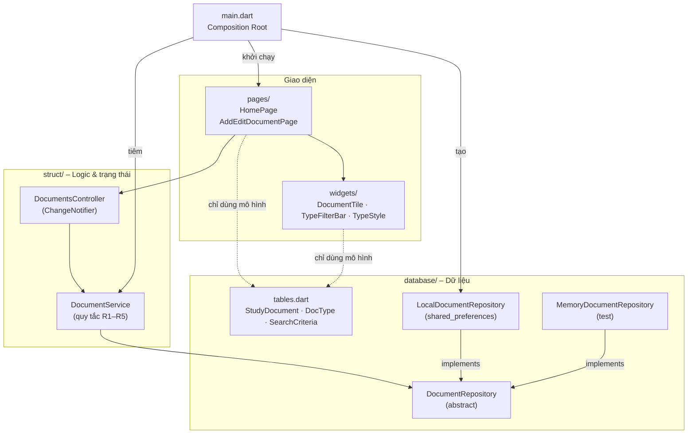
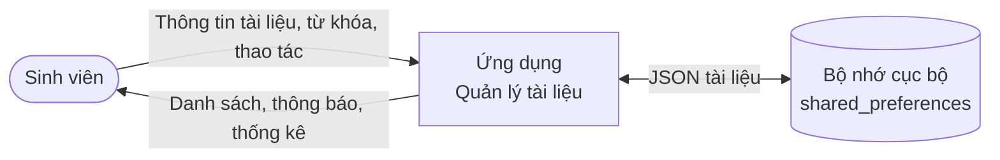
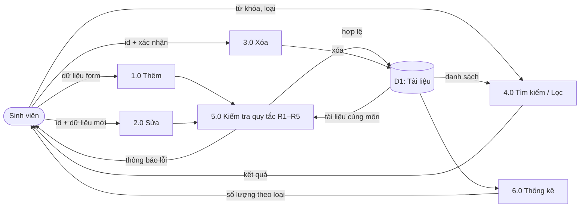
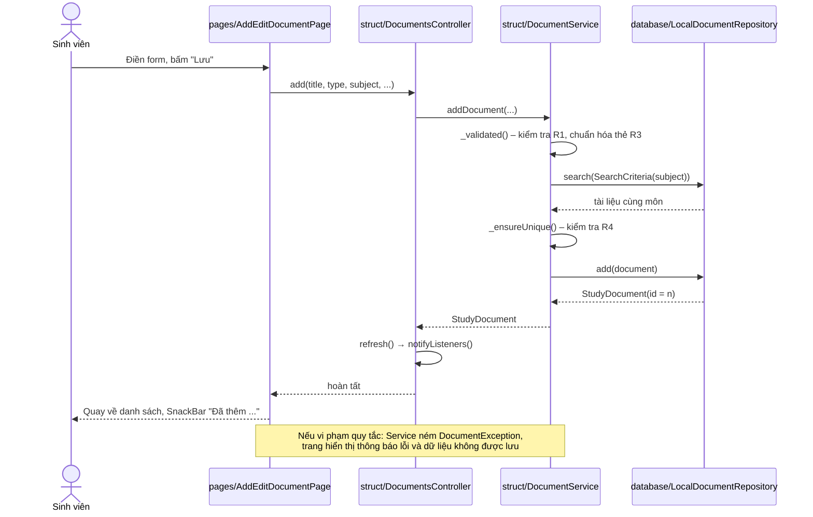

# BÁO CÁO THỰC HÀNH TH1
## Xây dựng Ứng dụng Quản lý Tài liệu Học tập theo Kiến trúc Cashew

- **Sinh viên:** ............................................ **MSSV:** ....................
- **Lớp / Nhóm:** ..........................................
- **Link GitHub:** https://github.com/bhanh8762-jpg/study_docs_cashew
- **Công nghệ:** Flutter 3.47 / Dart 3.13, `shared_preferences`, `flutter_test`, VS Code, GitHub Actions

---

## 1. Giới thiệu

Ứng dụng giúp sinh viên lưu trữ và tra cứu tài liệu học tập gồm **bài giảng, bài tập và tài liệu tham khảo**.
Mã nguồn được tổ chức theo **kiến trúc Cashew**, tức cách phân lớp của ứng dụng Flutter mã nguồn mở
*Cashew* (github.com/jameskokoska/Cashew). Trong ứng dụng đó, thư mục `lib/` được chia thành:

| Thư mục Cashew | Vai trò trong Cashew gốc | Vai trò trong ứng dụng này |
|---|---|---|
| `database/` | Bảng dữ liệu (Drift/SQLite) và truy vấn | Mô hình `StudyDocument`, giao diện `DocumentRepository` và các hiện thực lưu trữ |
| `struct/` | Logic, cấu hình, trạng thái dùng chung | `DocumentService` (nghiệp vụ), `DocumentsController` (trạng thái), các ngoại lệ |
| `pages/` | Các màn hình | `HomePage`, `AddEditDocumentPage` |
| `widgets/` | Thành phần giao diện tái sử dụng | `DocumentTile`, `TypeFilterBar`, `TypeStyle` |
| `main.dart` | Khởi tạo ứng dụng | Composition Root: tạo repository rồi tiêm vào các lớp |

Mục tiêu của thiết kế:

- **Tách lớp xử lý:** dữ liệu, nghiệp vụ và giao diện nằm ở các thư mục riêng.
- **Mô-đun hóa:** mỗi lớp kiểm thử được độc lập.
- **Dễ mở rộng:** có thể đổi cách lưu trữ hoặc thêm màn hình mà không sửa nghiệp vụ.

---

## 2. Phân tích yêu cầu (Checklist 1)

### 2.1. Yêu cầu chức năng

| Mã | Chức năng | Mô tả | Thao tác trên giao diện |
|---|---|---|---|
| F1 | Thêm tài liệu | Nhập tiêu đề, loại, môn học, đường dẫn, mô tả, thẻ | Nút **Thêm**, điền form, bấm **Lưu** |
| F2 | Sửa tài liệu | Sửa bất kỳ trường nào | Chạm vào tài liệu, sửa, bấm **Lưu** |
| F3 | Xóa tài liệu | Xóa sau khi xác nhận | Biểu tượng thùng rác, rồi chọn **Xóa** |
| F4 | Tìm kiếm | Theo từ khóa (tiêu đề, môn, mô tả, thẻ; có dấu tiếng Việt) | Ô tìm kiếm, kết quả lọc ngay khi gõ |
| F5 | Lọc theo loại | Bài giảng / Bài tập / Tham khảo | Các chip lọc |
| F6 | Thống kê | Số tài liệu theo từng loại | Biểu tượng biểu đồ trên AppBar |
| F7 | Lưu bền | Dữ liệu vẫn còn sau khi đóng app | Tự động |

### 2.2. Quy tắc nghiệp vụ

| Mã | Quy tắc | Vị trí |
|---|---|---|
| R1 | Tiêu đề và môn học không được rỗng (tự cắt khoảng trắng); tiêu đề tối đa 200 ký tự | `struct/document_service.dart` |
| R2 | Loại tài liệu ∈ {bài giảng, bài tập, tham khảo} | `database/tables.dart` (enum `DocType`) |
| R3 | Thẻ được chuẩn hóa: chữ thường, bỏ rỗng, bỏ trùng | `normalizeTags()` |
| R4 | Không có hai tài liệu trùng tiêu đề trong cùng một môn (không phân biệt hoa/thường) | `DocumentService._ensureUnique` |
| R5 | Sửa tài liệu thì giữ nguyên `id` và `createdAt`, còn `updatedAt` được cập nhật | `DocumentService.updateDocument` |

### 2.3. Yêu cầu phi chức năng
- Chạy được trên Chrome (Web), Windows và Android từ cùng một mã nguồn.
- Phân lớp được kiểm chứng tự động bằng kiểm thử kiến trúc.
- Mỗi lần push lên GitHub, CI tự chạy `flutter analyze` và `flutter test`.

### 2.4. Thực thể `StudyDocument`

| Trường | Kiểu Dart | Ghi chú |
|---|---|---|
| id | `int?` | Tự tăng, được gán khi lưu |
| title | `String` | Bắt buộc, ≤ 200 ký tự |
| type | `DocType` | lecture / exercise / reference |
| subject | `String` | Bắt buộc |
| filePath | `String` | Đường dẫn hoặc link tài liệu |
| description | `String` | Mô tả |
| tags | `List<String>` | Danh sách thẻ |
| createdAt, updatedAt | `DateTime` | Thời điểm tạo / cập nhật |

---

## 3. Sơ đồ kiến trúc và luồng dữ liệu

> Các sơ đồ viết bằng Mermaid, hiển thị trực tiếp trên GitHub và trong VS Code
> (extension *Markdown Preview Mermaid Support*).

### 3.1. Sơ đồ phân lớp



### 3.2. Ma trận phụ thuộc (được kiểm tra trong `test/architecture_test.dart`)

| Lớp \ được import | database | struct | widgets | pages |
|---|:-:|:-:|:-:|:-:|
| **database** | ✔ | ✘ | ✘ | ✘ |
| **struct** | ✔ | ✔ | ✘ | ✘ |
| **widgets** | chỉ `tables.dart` | ✘ | ✔ | ✘ |
| **pages** | chỉ `tables.dart` | ✔ | ✔ | ✔ |
| **main.dart** | ✔ | ✔ | ✔ | ✔ |

Thêm vào đó, `database/` và `struct/` **không được import** `package:flutter/material.dart`, tức không chứa mã giao diện.

### 3.3. Sơ đồ luồng dữ liệu (DFD)

**Mức 0 (ngữ cảnh):**



**Mức 1:**



### 3.4. Sơ đồ tuần tự: "Thêm tài liệu"



---

## 4. Cấu trúc thư mục (Checklist 2)

```
study_docs_cashew/
├── lib/
│   ├── main.dart                          # Composition Root
│   ├── database/
│   │   ├── tables.dart                    # StudyDocument, DocType, SearchCriteria
│   │   ├── document_repository.dart       # Giao diện trừu tượng
│   │   ├── local_document_repository.dart # Lưu bền (shared_preferences)
│   │   └── memory_document_repository.dart# Lưu trong bộ nhớ (test)
│   ├── struct/
│   │   ├── document_service.dart          # Nghiệp vụ Thêm/Sửa/Xóa/Tìm kiếm
│   │   ├── documents_controller.dart      # Trạng thái cho giao diện
│   │   └── exceptions.dart                # Lỗi nghiệp vụ
│   ├── pages/
│   │   ├── home_page.dart                 # Danh sách + tìm kiếm + lọc + xóa
│   │   └── add_edit_document_page.dart    # Form thêm / sửa
│   └── widgets/
│       ├── document_tile.dart
│       ├── type_filter_bar.dart
│       └── type_style.dart
├── test/
│   ├── architecture_test.dart             # Kiểm thử quy tắc phân lớp
│   ├── document_service_test.dart         # Kiểm thử nghiệp vụ
│   ├── repository_test.dart               # Contract test lớp dữ liệu
│   └── widget_test.dart                   # Kiểm thử giao diện
├── .vscode/                               # Cấu hình chạy / debug cho VS Code
├── .github/workflows/flutter.yml          # CI trên GitHub
└── docs/BAO_CAO.md
```

---

## 5. Triển khai chức năng (Checklist 3)

### 5.1. Lớp database
- `StudyDocument` là lớp **bất biến** (mọi trường `final`), sửa bằng `copyWith`, và có `toJson`/`fromJson`.
- `DocumentRepository` là **lớp trừu tượng**. Lớp `struct` chỉ biết đến lớp này.
- `LocalDocumentRepository` lưu danh sách dưới dạng JSON trong `shared_preferences`, chạy được trên Web, Windows và Android.
  Ứng dụng Cashew gốc dùng Drift/SQLite. Muốn chuyển sang Drift, chỉ cần thêm một class implement `DocumentRepository`.

### 5.2. Lớp struct
`DocumentService` nhận repository qua constructor (**Dependency Injection**):

```dart
class DocumentService {
  DocumentService(this._repo, {DateTime Function()? clock}) : _now = clock ?? DateTime.now;
  final DocumentRepository _repo;
```

| Phương thức | Chức năng |
|---|---|
| `addDocument(...)` | Kiểm tra R1, chuẩn hóa thẻ R3, kiểm tra trùng R4, lưu |
| `updateDocument(id, ...)` | Chỉ thay các trường được truyền vào, kiểm tra lại R1 và R4, cập nhật `updatedAt` (R5) |
| `deleteDocument(id)` | Ném `DocumentNotFoundException` nếu không tồn tại |
| `search(keyword, type, subject, tag)` | Tìm kiếm kết hợp nhiều tiêu chí |
| `statistics()` | Đếm theo loại |

`DocumentsController` (kế thừa `ChangeNotifier`) giữ danh sách đang hiển thị cùng từ khóa và bộ lọc.
Sau mỗi thao tác, controller gọi `refresh()` để giao diện tự cập nhật qua `ListenableBuilder`.

### 5.3. Lớp pages và widgets
- Các trang chỉ gọi `DocumentsController`, bắt `DocumentException` để hiển thị lỗi,
  và **không tự kiểm tra quy tắc nghiệp vụ** hay truy cập dữ liệu.
- Các widget chỉ nhận dữ liệu và callback, không chứa logic.

### 5.4. Composition Root (`main.dart`)

```dart
final repository = await LocalDocumentRepository.create();
final controller = DocumentsController(DocumentService(repository));
runApp(StudyDocsApp(controller: controller));
```

### 5.5. Ảnh chụp màn hình
*(Chèn ảnh chụp khi chạy: màn hình danh sách, form thêm, thông báo lỗi trùng, hộp thoại xóa, thống kê.)*

---

## 6. Kiểm thử tách biệt giữa các lớp (Checklist 4)

Lệnh `flutter test` cho kết quả **44 test, tất cả đạt** (`flutter analyze`: *No issues found*).

| File | Số test | Nội dung và ý nghĩa đối với kiến trúc |
|---|:-:|---|
| `architecture_test.dart` | 7 | Đọc mã nguồn trong `lib/` và kiểm tra **mỗi lớp chỉ import các lớp được phép** (ma trận mục 3.2), đồng thời kiểm tra `database` và `struct` không chứa mã giao diện. Có một test chứng minh bộ kiểm tra **phát hiện được vi phạm**. |
| `document_service_test.dart` | 19 | Kiểm thử nghiệp vụ với `MemoryDocumentRepository`, không cần giao diện hay lưu trữ thật. Dùng `SpyRepository` để chứng minh service **chỉ gọi qua giao diện trừu tượng** và **dữ liệu sai không bao giờ xuống tới repository**. |
| `repository_test.dart` | 12 | **Contract test**: cùng một bộ test chạy cho cả hai repository, chứng minh chúng **thay thế được cho nhau**. Có thêm test lưu bền và chuyển đổi JSON hai chiều. |
| `widget_test.dart` | 6 | Chạy toàn bộ giao diện với repository trong bộ nhớ, kiểm tra luồng Thêm, Sửa, Xóa, Tìm kiếm, Lọc và hiển thị lỗi. |

**Kết luận:** mỗi lớp được kiểm thử bằng cách thay lớp bên dưới bằng một bản giả. Việc này chỉ làm được khi các lớp
thực sự tách rời, nên chính bộ test là bằng chứng cho việc phân lớp đúng.

---

## 7. Môi trường phát triển: VS Code và GitHub

- **VS Code:** file `.vscode/launch.json` có sẵn các cấu hình *Chạy app (Chrome)*, *Chạy app (Windows)* và *Chạy tất cả test*,
  chỉ cần nhấn **F5**. File `.vscode/extensions.json` gợi ý cài các extension Dart, Flutter và Mermaid.
- **GitHub:** mã nguồn được quản lý bằng Git. Workflow `.github/workflows/flutter.yml` tự chạy `flutter analyze`
  và `flutter test` mỗi khi push hoặc tạo pull request.

---

## 8. Khả năng mở rộng

| Kịch bản | Phần cần sửa | Phần **không** phải sửa |
|---|---|---|
| Chuyển sang SQLite/Drift hoặc Firebase | Thêm 1 class trong `database/`, đổi 1 dòng ở `main.dart` | struct, pages, widgets |
| Thêm màn hình chi tiết hoặc giao diện tablet | Thêm file trong `pages/` và `widgets/` | database, struct |
| Thêm loại tài liệu (ví dụ "Đề thi") | Thêm giá trị vào `DocType` và màu/biểu tượng trong `TypeStyle` | service, repository |
| Thêm quy tắc nghiệp vụ | `struct/document_service.dart` | database, pages |

---

## 9. Kết luận

1. Đã phân tích yêu cầu và có DFD mức 0 và 1, sơ đồ phân lớp, sơ đồ tuần tự.
2. Thư mục được tổ chức theo kiến trúc Cashew: `database / struct / pages / widgets`.
3. Đã triển khai Thêm, Sửa, Xóa, Tìm kiếm, cùng chức năng lọc và thống kê.
4. Có 44 kiểm thử tự động, trong đó có kiểm thử kiến trúc.
5. Mã nguồn được đóng gói trên GitHub (có CI) kèm báo cáo này.

**Hướng phát triển:** chuyển sang Drift/SQLite như Cashew gốc, đính kèm file PDF thật, đồng bộ đám mây,
và sắp xếp theo ngày hoặc môn học.
